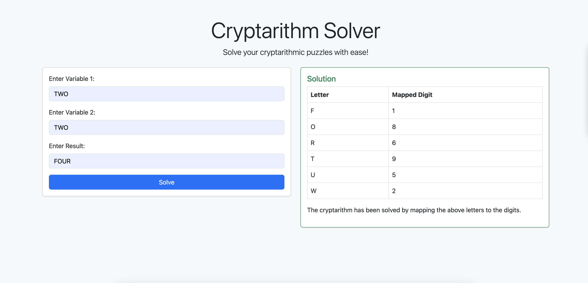

# Cryptarithm Solver

This project is developed for the **DevFest 2024 - Google Developer Group** workshop in Bandung, where we explore solving cryptarithmic puzzles using a web-based application. It consists of a backend service that performs the solving logic and a frontend interface where users can input the cryptarithmic puzzle.

## Project Structure
The project is organized as follows:
```cmd
.
├── README.md
├── backend             # Backend code
│   └── app.py          # Flask app for solving cryptarithms
└── frontend            # Frontend code
    ├── index.html      # HTML file for the user interface
    ├── script.js       # JavaScript file for handling the logic and AJAX requests
    └── style.css       # CSS file for styling the frontend
```

## Prerequisites
### Backend
To run the backend, you'll need to have the following installed:
- Python 3.7 or above
- Flask: The backend is built using Flask, a Python web framework.

To install run this command:
```cmd
pip install Flask
```
Run the backend with this command:
```cmd
python app.py
```
This will start the backend server on http://127.0.0.1:5000

### Frontend
- http-server: A simple, zero-config command-line HTTP server for serving static files. This is required to run the frontend on your local machine.

To install run this command:
```cmd
npm install -g http-server
```

## How to Run
1. Make sure all the prerequisites satisfied.
2. Clone the repository or download the project folder.
3. Run the backend program
```cmd
python backend/app.py
```
4. Navigate to the frontend folder
```cmd
cd frontend
```
Serve the Frontend with http-server
```cmd
http-server
```
This will serve the frontend at http://127.0.0.1:8080

You can change the backend URL in [config.js](frontend/config.js).

## Screenshot
